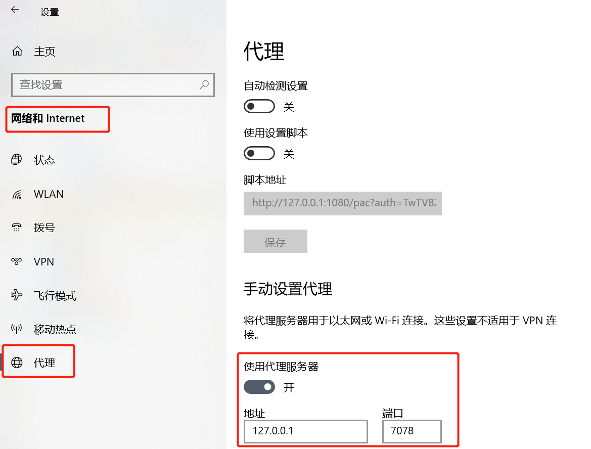

# :mega: ChatUnitest Maven Plugin

[English](./README.md) | [中文](./Readme_zh.md)

[](https://maven-badges.herokuapp.com/maven-central/io.github.ZJU-ACES-ISE/chatunitest-maven-plugin)

## 更新
💥 允许使用多线程更快地生成单元测试！

## 运行步骤

### 0. `pom.xml`文件配置

在项目的`pom.xml`文件内加入 chatunitest-maven-plugin 的插件配置，并按照您的需求添加参数：
```xml
<plugin>
    <groupId>io.github.ZJU-ACES-ISE</groupId>
    <artifactId>chatunitest-maven-plugin</artifactId>
    <version>1.0.0</version>
    <configuration>
        <!-- Required: You must specify your OpenAI API keys. -->
        <apiKeys></apiKeys>
        <model>gpt-3.5-turbo</model>
        <testNumber>5</testNumber>
        <maxRounds>5</maxRounds>
        <minErrorTokens>500</minErrorTokens>
        <temperature>0.5</temperature>
        <topP>1</topP>
        <frequencyPenalty>0</frequencyPenalty>
        <presencePenalty>0</presencePenalty>
        <proxy>${proxy}</proxy>
    </configuration>
</plugin>
```

**下面是每个配置选项的详细说明:**

- `apiKeys`: (**必需**) 您的OpenAI API keys，示例：`Key1, Key2, ...`
- `model`: (**可选**) OpenAI模型，默认值：`gpt-3.5-turbo`
- `testNumber`: (**可选**) 每个方法的生成的测试数量，默认值：`5`
- `maxRounds`: (**可选**) 修复过程的最大轮次，默认值：`5`
- `minErrorTokens`: (**可选**) 修复过程中错误信息的最小token数，默认值：`500`
- `temperature`: (**可选**) OpenAI API参数，默认值：`0.5`
- `topP`: (**可选**) OpenAI API参数，默认值： `1`
- `frequencyPenalty`: (**可选**) OpenAI API参数，默认值： `0`
- `presencePenalty`: (**可选**) OpenAI API参数，默认值： `0`
- `proxy`: (**可选**)如果需要，填写您的主机名和端口号，示例：`127.0.0.1:7078`

一般情况下，您只需要提供API密钥。如果出现APIConnectionError，您可以在proxy参数中添加您的代理ip和端口号。Windows系统里下的代理ip和端口可以在设置->网络和Internet->代理中查看：



### 1. 将以下依赖项添加到`pom.xml`文件中
```xml
<dependencies>
    <dependency>
        <groupId>org.junit.jupiter</groupId>
        <artifactId>junit-jupiter-api</artifactId>
        <version>5.8.2</version>
        <scope>test</scope>
    </dependency>
    <dependency>
        <groupId>org.mockito</groupId>
        <artifactId>mockito-core</artifactId>
        <version>3.12.4</version>
        <scope>test</scope>
    </dependency>
    <dependency>
        <groupId>org.mockito</groupId>
        <artifactId>mockito-junit-jupiter</artifactId>
        <version>3.12.4</version>
        <scope>test</scope>
    </dependency>
    <dependency>
        <groupId>org.mockito</groupId>
        <artifactId>mockito-inline</artifactId>
        <version>3.12.4</version>
        <scope>test</scope>
    </dependency>
</dependencies>
```

```xml
<plugin>
    <groupId>org.apache.maven.plugins</groupId>
    <artifactId>maven-surefire-plugin</artifactId>
    <version>3.1.0</version>
</plugin>
```

### 2. 运行

**您可以用下面的命令运行插件:**

**为目标方法生成单元测试：**

```shell
mvn chatunitest:method -DselectMethod=className#methodName
```

**为目标类生成单元测试：**

```shell
mvn chatunitest:class -DselectClass=className
```

当执行 `mvn chatunitest:method` 或 `mvn chatunitest:class` 命令时，您必须指定 `selectMethod` 和 `selectClass`，可以使用 -D 选项来实现这一点。
以下是您可以使用 `-D` 选项指定的所有参数：

- `selectClass`: (**可选**) 被测试的类，如果项目中有同名类，需要指定完整的类名。
- `selectMethod`: (**可选**) 被测试的方法
- `tmpOutput`: (**可选**) 解析项目信息的输出路径，默认值： `/tmp/chatunitest-info`
- `testOutput`: (**可选**) 由 `chatunitest`生成的测试的输出路径，默认值：`{basedir}/chatunitest`
- `project`: (**可选**) 目标项目路径，默认值：`{basedir}`
- `thread`: (**可选**) 开启或关闭多线程，默认值：`true`
- `maxThread`: (**可选**) 最大线程数，默认值：`CPU核心数 * 10`
- `stopWhenSuccess`: (**可选**) 是否在生成一个成功的测试后停止，默认值：`true`

您也可以在pom.xml中设置插件配置，而不是使用`-D`选项，例如`<maxThreads>30</maxThreads>`

示例：

```
public class Example {
    public void method1(Type1 p1, ...) {...}
    public void method2() {...}
    ...
}
```

对Example类及其所有方法进行测试：

```shell
mvn chatunitest:class -DselectClass=Example
```

对Example类中的方法method1进行测试：（目前ChatUnitest将为类中所有名为method1的方法生成测试）

```shell
mvn chatunitest:method -DselectMethod=Example#method1
```

**为整个项目生成单元测试：**

:warning: :warning: :warning: 对于大型项目来说，可能会消耗大量的token，导致相当大的费用。

```shell
mvn chatunitest:project
```

**清理生成的测试代码：**

```shell
mvn chatunitest:clean
```

运行该命令将删除所有生成的测试代码并恢复您的测试文件夹。

**注意:** 在运行生成的测试代码时，ChatUnitest会将您的测试文件夹备份到`src/backup/`目录，
并将生成的测试拷贝到`src/test/java/`目录下运行，同时也便于您手动运行测试。您需要使用以下命令手动恢复测试文件夹：`mvn chatunitest:restore`

## 可运行环境

ChatUnitest Maven Plugin可以在多个操作系统和不同的 Java 开发工具包和 Maven 版本下运行。以下是已测试并可运行的环境：

- Environment 1: Windows 11 / Oracle JDK 11 / Maven 3.9
- Environment 2: Windows 10 / Oracle JDK 11 / Maven 3.6
- Environment 3: Ubuntu 22.04 / OpenJDK 11 / Maven 3.6
- Environment 4: Darwin Kernel 22.1.0 / Oracle JDK 11 / Maven 3.8

请注意，这些环境是经过测试并可成功运行的示例，您也可以尝试在其他类似的环境中运行该插件。如果您在其他环境中遇到问题，请查看文档或联系开发者。

## :construction: TODO

- 添加代码混淆以避免将原始代码发送到 ChatGPT
- 添加费用估算和配额
- 优化生成的测试用例的结构

## MISC

我们的工作已经提交到arXiv，链接指路：[ChatUniTest](https://arxiv.org/abs/2305.04764).

```
@misc{xie2023chatunitest,
      title={ChatUniTest: a ChatGPT-based automated unit test generation tool}, 
      author={Zhuokui Xie and Yinghao Chen and Chen Zhi and Shuiguang Deng and Jianwei Yin},
      year={2023},
      eprint={2305.04764},
      archivePrefix={arXiv},
      primaryClass={cs.SE}
}
```

## :email: 联系我们

如果您有任何问题或想了解我们的实验结果，请随时通过电子邮件与我们联系，联系方式如下：

1. Corresponding author: `zjuzhichen AT zju.edu.cn`
2. Author: `yh_ch AT zju.edu.cn`, `xiezhuokui AT zju.edu.cn`


