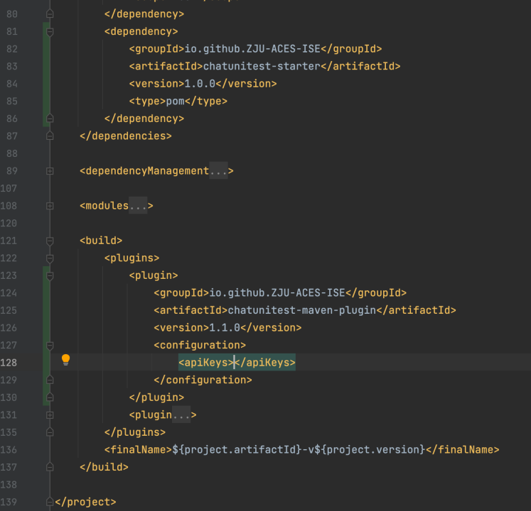
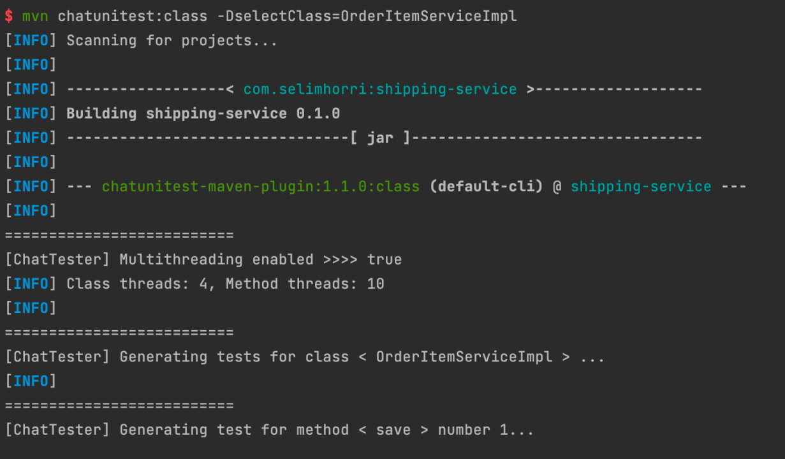
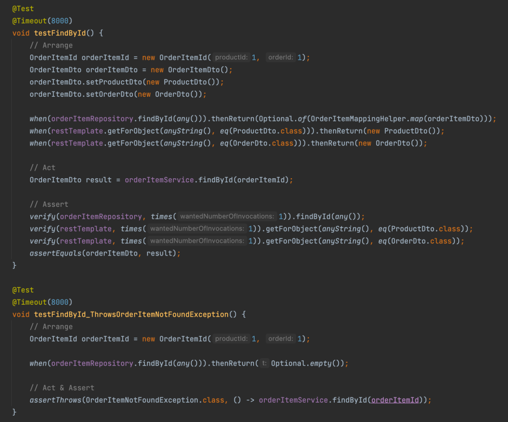
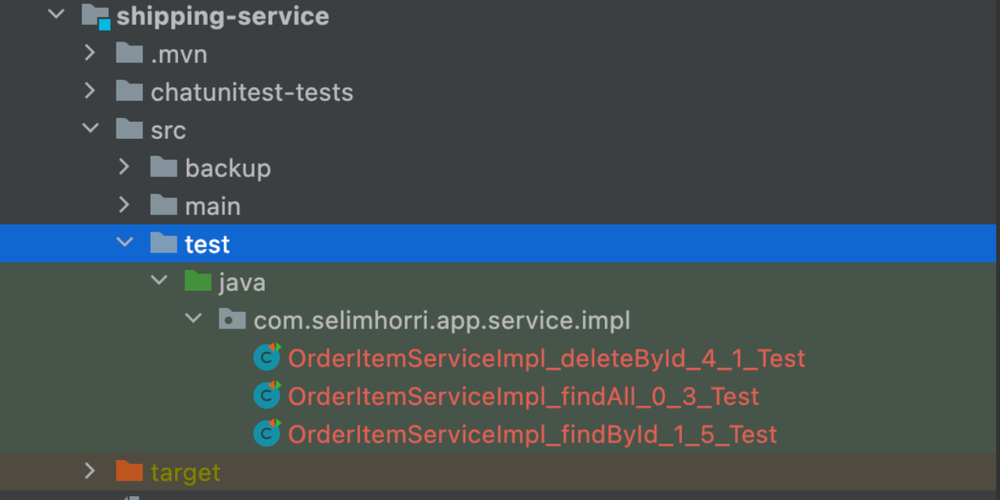
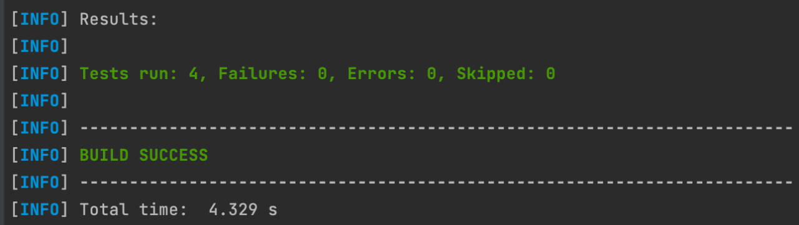
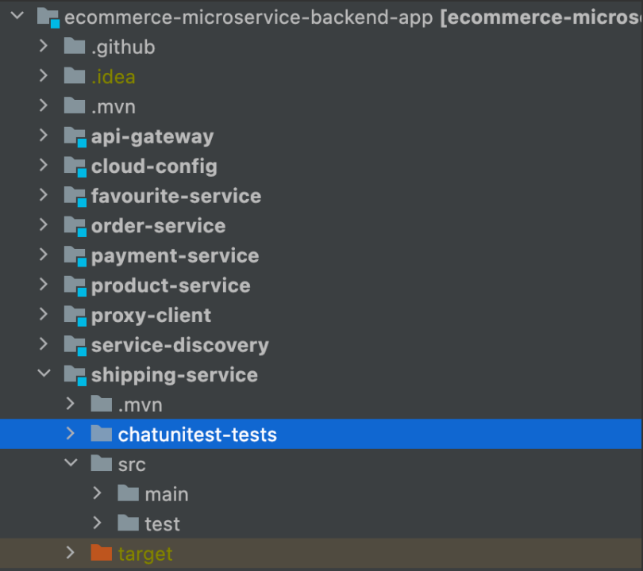
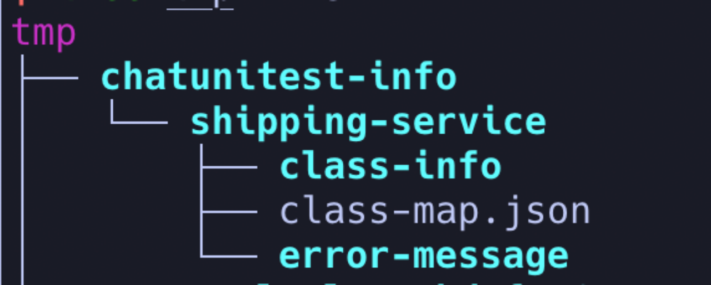

# ChatUniTest：一个基于ChatGPT的Java单元测试自动生成工具

## 简介：

相信很多人试过用ChatGPT帮助自己完成各种各样的编程任务，并且已经取得了不错的效果。但是，直接使用ChatGPT存在一些问题：
一是生成的代码很多时候不能正常执行，“编程五分钟，调试两小时”；
二是不方便跟现有工程进行集成，需要手动与ChatGPT进行交互，并且在不同页面间切换。为了解决这些问题，我们提出了“生成-验证-修复”框架，并实现了原型系统，同时为了方便大家使用，我们开发了一些插件，能够方便的集成到已有开发流程中。
已完成[Maven插件](https://github.com/ZJU-ACES-ISE/chatunitest-maven-plugin)
开发，最新版1.1.0已发布到Maven中心仓库，欢迎试用和反馈。IDEA插件正在开发中，欢迎持续关注。

<div style="text-align:right">
联系人：智晨

主要开发人员：陈膺浩、吴孜璇、谢卓魁

浙江大学ACES实验室
</div>

## 原理：


针对待测方法，首先收集一些待测方法中必要的上下文信息，让ChatGPT进行初始生成，然后验证ChatGPT生成的测试用例是否正确，
如果不正确，则根据编译器的报错信息进行修复，其中，对于一些常见的简单错误，使用预定义规则进行修复，对于其余错误，则让ChatGPT修复测试用例，
如此循环迭代，直至测试用例正确执行，或者达到最大迭代次数。

## 使用：

### 1. 在项目的pom.xml文件内加入 chatunitest-maven-plugin 的插件配置，并按照您的需求添加参数：

```xml

<plugin>
    <groupId>io.github.ZJU-ACES-ISE</groupId>
    <artifactId>chatunitest-maven-plugin</artifactId>
    <version>1.1.0</version>
    <configuration>
        <!-- Required: You must specify your OpenAI API keys. -->
        <apiKeys></apiKeys>
        <model>gpt-3.5-turbo</model>
        <testNumber>5</testNumber>
        <maxRounds>5</maxRounds>
        <minErrorTokens>500</minErrorTokens>
        <temperature>0.5</temperature>
        <topP>1</topP>
        <frequencyPenalty>0</frequencyPenalty>
        <presencePenalty>0</presencePenalty>
        <proxy>${proxy}</proxy>
    </configuration>
</plugin>
```

下面是每个配置选项的详细说明:

- `apiKeys`: (**必需**) 您的OpenAI API keys，示例：`Key1, Key2, ...`
- `model`: (**可选**) OpenAI模型，默认值：`gpt-3.5-turbo`
- `testNumber`: (**可选**) 每个方法的生成的测试数量，默认值：`5`
- `maxRounds`: (**可选**) 修复过程的最大轮次，默认值：`5`
- `minErrorTokens`: (**可选**) 修复过程中错误信息的最小token数，默认值：`500`
- `temperature`: (**可选**) OpenAI API参数，默认值：`0.5`
- `topP`: (**可选**) OpenAI API参数，默认值： `1`
- `frequencyPenalty`: (**可选**) OpenAI API参数，默认值： `0`
- `presencePenalty`: (**可选**) OpenAI API参数，默认值： `0`
- `proxy`: (**可选**)如果需要，填写您的主机名和端口号，示例：`127.0.0.1:7078`
- `selectClass`: (**可选**) 被测试的类，如果项目中有同名类，需要指定完整的类名。
- `selectMethod`: (**可选**) 被测试的方法
- `tmpOutput`: (**可选**) 解析项目信息的输出路径，默认值： `/tmp/chatunitest-info`
- `testOutput`: (**可选**) 由 `chatunitest`生成的测试的输出路径，默认值：`{basedir}/chatunitest`
- `project`: (**可选**) 目标项目路径，默认值：`{basedir}`
- `thread`: (**可选**) 开启或关闭多线程，默认值：`true`
- `maxThread`: (**可选**) 最大线程数，默认值：`CPU核心数 * 5`
- `stopWhenSuccess`: (**可选**) 是否在生成一个成功的测试后停止，默认值：`true`
- `noExecution`: (**可选**) 是否跳过执行测试验证的步骤，默认值：`false`

一般情况下，您只需要提供API密钥。如果出现APIConnectionError，您可以在proxy参数中添加您的代理ip和端口号。Windows系统里下的代理ip和端口可以在设置->网络和Internet->代理中查看。

### 2. 将以下依赖项添加到`pom.xml`文件中

```xml

<dependency>
    <groupId>io.github.ZJU-ACES-ISE</groupId>
    <artifactId>chatunitest-starter</artifactId>
    <version>1.0.0</version>
    <type>pom</type>
</dependency>
```

### 3. 通过运行`mvn compile`或`mvn install`命令下载所需的依赖。

### 4. 通过以下命令运行插件:

**为目标方法生成单元测试：**

```shell
mvn chatunitest:method -DselectMethod=className#methodName
```

**为目标类生成单元测试：**

```shell
mvn chatunitest:class -DselectClass=className
```

当执行 `mvn chatunitest:method` 或 `mvn chatunitest:class` 命令时，您必须指定 `selectMethod` 和 `selectClass`，可以使用 -D 选项来实现这一点。


**为整个项目生成单元测试：**
注意，对于大型项目来说，可能会消耗大量的token，导致相当大的费用。

```shell
mvn chatunitest:project
```

**清理生成的测试代码：**

```shell
mvn chatunitest:clean
```

运行该命令将删除所有生成的测试代码并恢复您的测试目录。

**手动运行生成的测试：**

```shell
mvn chatunitest:copy
```

运行该命令将复制所有生成的测试代码到您的测试文件夹，同时备份您的测试目录。

```shell
mvn chatunitest:restore
```

运行该命令将恢复您的测试目录

## 演示：

我们以一个Spring Boot项目[ecommerce-microservice-backend-app](https://github.com/SelimHorri/ecommerce-microservice-backend-app)为例，
对该项目的`shipping-service`模块下的`com.selimhorri.app.service.impl.OrderItemServiceImpl`类进行测试，包含`findAll`，`findById`，`save`，`update`，`deleteById`这五个方法。
首先，在pom.xml中配置依赖和插件：


基本上，只需配置你的OpenAI API Keys，ChatUniTest就可以正常运行了。你也可以根据需要配置各种参数([详情](https://github.com/ZJU-ACES-ISE/chatunitest-maven-plugin/blob/main/README.md))。


首先你需要运行`mvn compile`（或者`package` `install`）保证模块已经编译。运行`mvn chatunitest:class -DselectClass=OrderItemServiceImpl`，
这条命令中，`chatunitest:class`以单个class为目标，`-DselectClass`选择`OrderItemServiceImpl`类，然后ChatUniTest就会自动对该类中的每个方法生成单元测试，
这个过程可能需要几分钟，你可以通过增加最大线程数量`maxThreads`以及设置`noExecution`为`true`来加快测试生成
（`noExecution`设置为`true`将跳过测试执行验证，仅进行编译验证，不能保证mock和assertion正确以及其他运行时可能会出现的问题）。


ChatUniTest生成的单元测试默认会存放在`chatunitest-tests`目录下，在我们的例子中，ChatUniTest成功对`OrderItemServiceImpl`生成了三个测试。
测试命名规则为：`类名_方法名_方法id_测试id_Test`。


`OrderItemServiceImpl_findById_1_5_Test`中的两个测试用例示例。接下来，我们使用Maven提供的`mvn test`执行ChatUniTest生成的单元测试，检查能否正常执行。


使用`mvn chatunitest:copy`将`chatunitest-tests`目录下的测试拷贝到`src/test`目录，原来的`src/test`目录会自动备份到`src/backup`目录下。然后命令行执行`mvn test`.


这里ChatUniTest生成的四个测试用例正常执行了。


完成检查后，使用`mvn chatunitest:restore`命令恢复备份的测试目录。
最后，使用`mvn chatunitest:clean`命令清除ChatUniTest生成的测试，以及所有临时文件（储存在`/tmp/chatunitest-info`目录下的项目解析和测试编译执行过程中的错误信息）。
临时目录结构如下：


